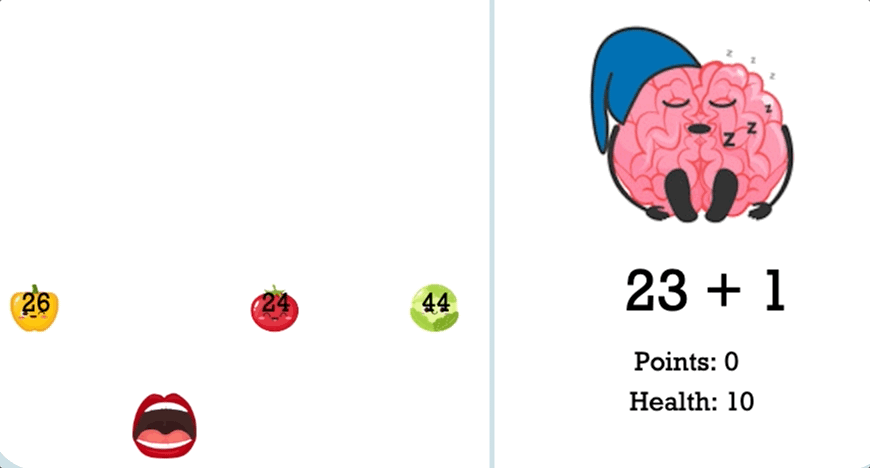

## Hungry Brain

[Click to Play!](https://d-tamang.github.io/hungry-brain/)

## Background

Hungry Brain is an addition math game for kids that helps enhance multitasking skills as users must focus on solving the equation whilst using the arrow keys to slide the mouth back and forth to both catch and avoid falling numbers. The objective is to "catch" the number that answers the equation on the right, wherein doing so will trigger a new problem to be randomly generated, and a new image of Brian the Brain to display. Correct answers increase points, and incorrect answers decrease health. Earn 10 points to win. Game is lost when the health counter reaches zero.

## Demo

## Technologies Implemented

  - Vanilla JavaScript
  - HTML5 Canvas
  - CSS
  - Webpack/Babel
  
 ## Future Additions
  - Numerous difficulty levels featuring various different mathematical operations
  - Incorporating different subjects beyond math in a quiz-style key-value matching game
