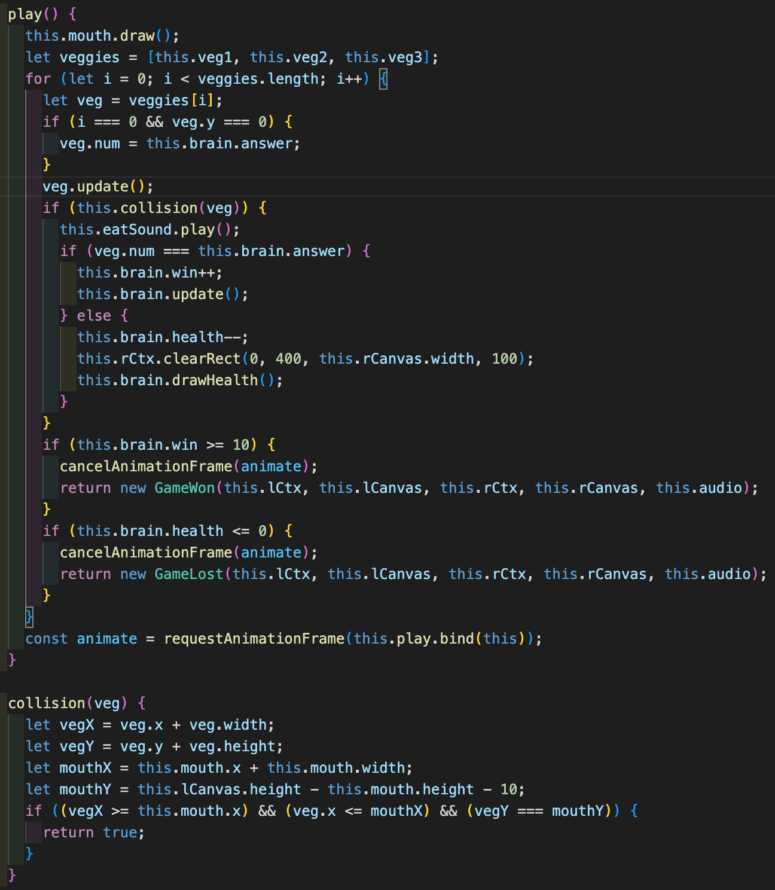

## Hungry Brain

[Click to Play!](https://d-tamang.github.io/hungry-brain/)

## Background

Hungry Brain is a simple single-player math game for kids meant to enhance addition and multitasking skills. Players are instructed to use the left and right keyboard keys to move the mouth object and "eat" numbers falling from the top of the game board. The objective is to catch the number that solves the addition problem featured on the right under Brian the Brain. Every correct number caught renders a new equation, image of Brian, and positively increments the points counter. Every wrong answer negatively decrements Brian's health counter, ending the game as a loss when it reaches 0. Game is won when the player earns 10 points.

## Demo GIF

## Code Snippet

The game is organized and rendered through a succession of class instances. The entry file starts a new start screen class, where it instanciates a new game class via a click handler event listener. The Game class instantiates the various game pieces, with the main gameplay logic occurring in the play method, as pictured below.

## Technologies Implemented

  - Vanilla JavaScript
  - HTML5 Canvas
  - CSS
  - Webpack/Babel
  
 ## Future Additions
  - Multiple difficulty levels featuring various types of mathematical operations
  - Incorporating different subjects beyond math in a quiz-style key-value pair matching game
