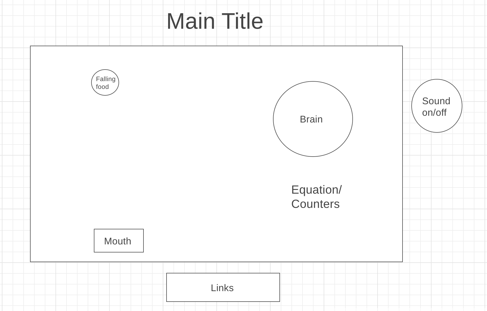

## Hungry Brain

https://d-tamang.github.io/hungry-brain/

## Background

Hungry Brain is a math game for kids that features basic addition problems. Various numbers fall from the top of the game screen, and the objective is to move the sliding mouth to "catch" the correct one. Once a problem is successfully solved, a new one is generated. If the wrong number is caught, the health counter will decrease, losing the game if it reaches 0. The game is won by earning 10 points.

## Functionality & MVPs

In Hungry Brain, users will be able to:
  - Start and replay the game
  - Use the L and R arrow keys to slide the mouth and catch the numbers
  - Play/pause the background audio

In addition, this project will include:
  - A start screen containing game instructions/rules
  - A winning/losing end screen
  - A production README
  - Links to my LinkedIn and GitHub profile

## Wireframe

## Technologies, Libraries, APIs

This project will be implemented with the following technologies:

  - Canvas API to render the game displays
  - Webpack and Babel to bundle and transpile the source JavaScript code
  - Vanilla JS DOM API for basic DOM manipulation

## Implementation Timeline

  - Friday Afternoon & Weekend: Setup project and render the board elements on the browser. Implement basic logic of incrementing a points counter with correct answers, decrementing a health counter with wrong answers, and rendering a different brain image with each correct answer. Render game losing/winning screen.
  - Monday: Develop code to bring movement to the mouth and number objects. Tie together the logic of "catching" numbers to increase points/decrease health.
  - Tuesday: Put background audio, and the option to mute it. Add any sound effects.
  - Wednesday: Improve game aesthetics and add LI/GH links.
  - Thursday Morning: Deploy to GitHub. Write a production README.
  
 ## Bonus Features
  - Add levels of difficulties featuring more advanced operations
  - Add options to choose subjects - math, geography, trivia, etc...
